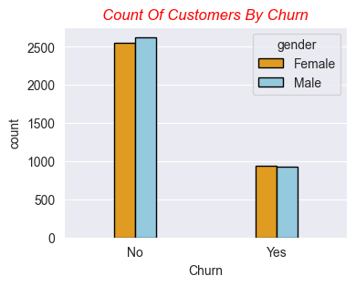
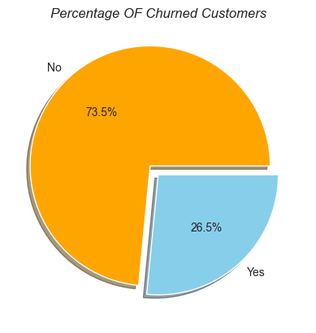
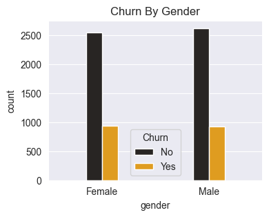
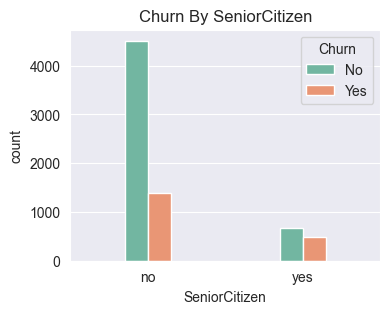
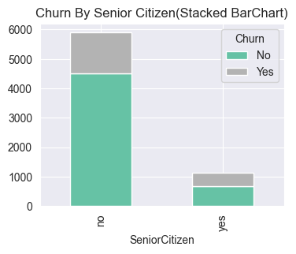
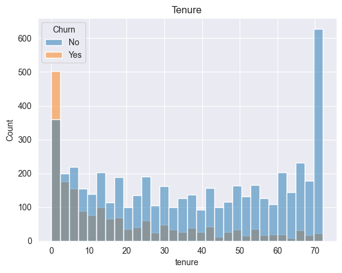
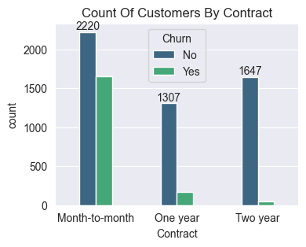
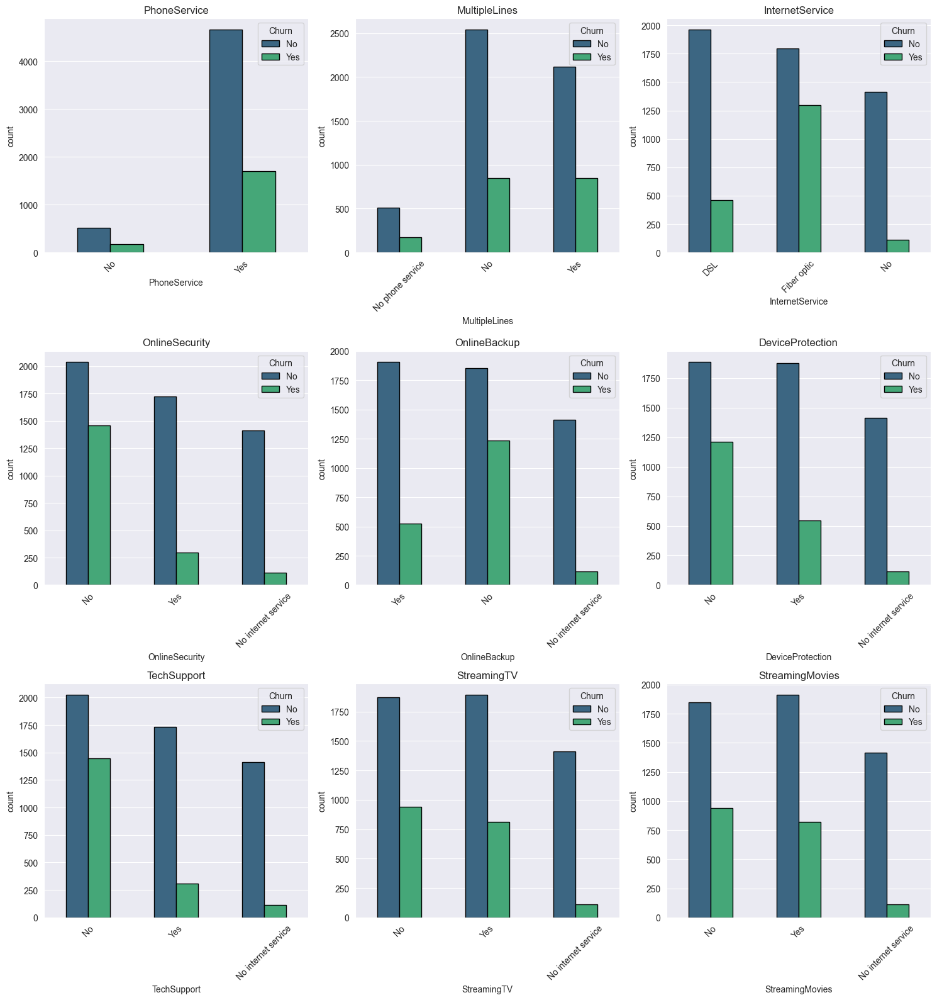
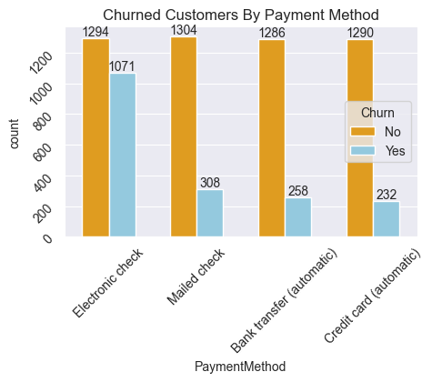

# Telecom Customer Churn — EDA Project

**Exploratory Data Analysis (EDA)** project investigating customer churn in a telecom company.  
This repository performs data cleaning, visualization, and analysis to surface the key drivers of churn and provide actionable insights to improve customer retention.

## 🚀 Highlights
- **Objective:** Identify factors that influence customer churn using descriptive analysis and visualizations.  
- **Tech stack:** Jupyter Notebook, Python (pandas, numpy, matplotlib, seaborn) and visual storytelling.  
- **Outputs:** Cleaned dataset, rich visualizations, summary of insights & recommendations for product and retention teams.

---

## Table of Contents
- [Project Overview](#project-overview)  
- [Dataset](#dataset)
- [Tech Stack]
- [Visualizations]
- [What I analyzed](#what-i-analyzed)  
- [How to run this project locally](#how-to-run-this-project-locally)  
- [Key Findings](#key-findings)
- [File Structure](#file-structure)  
- [Recommendations](#recommendations)  
- [Contributing & Contact](#contributing--contact)

---

## Project Overview
This repository contains an exploratory analysis of a telecom customer dataset to uncover patterns and relationships that correlate with churn. The goal is to provide **clear insights** and **visual evidence** to help the business act (e.g., targeted offers, service improvements).

---

## Dataset
- Typical columns included (may vary): customerID, gender, SeniorCitizen, Partner, Dependents, tenure, PhoneService, MultipleLines, InternetService, OnlineSecurity, OnlineBackup, DeviceProtection, TechSupport, StreamingTV, StreamingMovies, Contract, PaperlessBilling, PaymentMethod, MonthlyCharges, TotalCharges, Churn.
- **Note:** If the dataset is not yet in the repo, place it in a `data/` folder and update the notebook path accordingly.

---

# Tech Stack:

Language: Python 🐍

Environment: Jupyter Notebook 📓

Libraries:

Pandas 🗃️ (data manipulation)
Matplotlib 📊 (visualization)
Seaborn 🎨 (statistical visualization)


## Visualizations included
- 
- 
- 
- 
- 
- 
- 
- 
- 

---

## What I analyzed
- Data quality & cleaning: missing values, data types, inconsistent formats.
- Customer demographics: age/seniority, gender, partner/dependents.
- Services usage: internet, streaming, support options.
- Billing & contracts: monthly charges, total charges, contract term, payment methods.
- Churn patterns: segmentation by contract type, tenure, monthly charges, and services.
- Visualizations: bar plots, histograms, boxplots, correlation heatmap, churn breakdowns.

---

## How to run this project locally

1. Clone the repo
```bash
git clone https://github.com/RizwanHussain377/Telecom-Customer-Churn-EDA_Project.git
cd Telecom-Customer-Churn-EDA_Project
```

2. (Recommended) Create and activate a virtual environment
```bash
python -m venv venv
# macOS / Linux
source venv/bin/activate
# Windows (PowerShell)
venv\Scripts\Activate.ps1
```

3. Install dependencies
```bash
pip install -r requirements.txt
```
If `requirements.txt` is not present, install the common packages:
```bash
pip install pandas numpy matplotlib seaborn jupyter scikit-learn notebook
```

4. Start Jupyter Notebook / Lab
```bash
jupyter notebook
# or
jupyter lab
```

5. Open the EDA notebook (e.g., `Telecom_Churn_EDA.ipynb`) and run cells sequentially.  
   To run the whole notebook and save outputs:
```bash
jupyter nbconvert --to notebook --execute Telecom_Churn_EDA.ipynb --output executed_notebook.ipynb
```

---

## Key Findings
- **Shorter tenure** customers churn at a much higher rate — **tenure is a strong predictor**.  
- **Month-to-month contracts** experience significantly higher churn than one- or two-year contracts.  
- **Higher monthly charges** are correlated with higher churn, especially when combined with month-to-month contracts.  
- Customers without bundled services (e.g., no tech support or online security) show increased churn — **service add-ons help retention**.  
- **PaperlessBilling** has a small but notable association with churn (helpful for targeted communications).

---


## File Structure
- Telecom-Customer-Churn-EDA_Project/
  - data/                  — dataset(s) (CSV recommended)
  - notebooks/             — Jupyter notebooks (main EDA notebook)
  - images/                — exported plots and visuals
  - README.md              — (this file)
  - requirements.txt       — Python dependencies (create if missing)

---

## Recommendations (actionable next steps)
- Prioritize retention for **month-to-month** customers — offer discounts or loyalty incentives within the first 3 months.  
- Introduce or promote **support/online security bundles** to at-risk segments.  
- Use **tenure-based campaigns** (e.g., milestone offers at 1, 6, 12 months).  
- Build a churn prediction model as the next phase to automate outreach targeting.

---

## 📬 Contact
Created by **Rizwan Hussain**  

**GitHub**: [](https://github.com/RizwanHussain02)

**LinkedIn**: [](https://linkedin.com/in/rizwanhussain-)

### ⭐ If you found this helpful, consider giving the repo a **star**!

